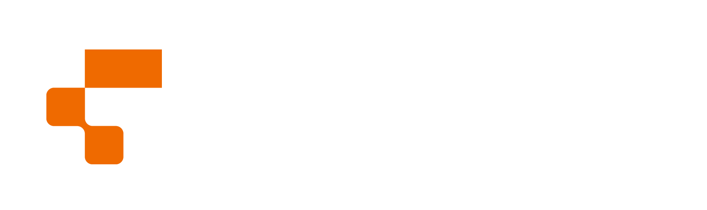

<p align="center">
  
</p>

# Introduction  
Our project is a lightweight and customizable typing test, inspired by [MonkeyType](https://monkeytype.com/). It will be implemented in Rust and feature both a command-line interface (CLI) and a web-based UI. Test yourself in various modes, track your progress and improve your speed.

# Motivation 
Existing typing tests often focus either on visual effects and gamification or, conversely, on a minimalistic interface without flexibility. This leads to some tools being too heavy and overloaded with unnecessary features, while others are limited in customization and use. In addition, most popular solutions are written in high-level languages, which affects their performance. Our project is aimed at creating a fast, cross-platform typing test with minimalistic design, support for custom settings and the ability to work both in the CLI and in the browser to use it both while surfing the web or while writing working projects right in the console.

# Architecture
The application will have three main components:  
- Core Logic Module – handles word selection, test flow, timing, and accuracy tracking
- CLI Interface Module – provides a terminal-based interface with friendly visualization in the console
- Web Interface Module – implements a browser-based interface using WebAssembly

```
                   
                                ┌────────────────────┐                
                                │                    │                
                                │   Keyboard Input   │                
                                │                    │                
                                └──────────┬─────────┘                
                                           │                          
                                           │                          
                          ┌────────────────▼─────────────────┐        
                          │                                  │        
                          │   Core Logic Block               │        
                          │   - Test generation              │        
                          │   - WPM & accuracy calculation   │        
                          │   - Mistake tracking             │        
                          │   - Customization                │        
                          │                                  │        
                          └─────┬──────────────────────┬─────┘        
                                │                      │              
                                │                      │              
                   ┌────────────▼────────┐    ┌────────▼─────────────┐
                   │                     │    │                      │
                   │   CLI Interface     │    │   Web Interface      │
                   │   - Terminal UI     │    │   - WebAssembly      │
                   │   - Text-based UX   │    │   - HTML/CSS/JS UI   │
                   │                     │    │                      │
                   └─────────────────────┘    └──────────────────────┘
                   
```

# Structure

Accordingly, the project is organized into modular crates:
- `core/` - contains all shared logic and data structures. It acts as the backend engine for both CLI and Web interfaces
- `cli/` - implements the terminal-based user interface. It interacts with the core logic to render tests in a CLI
- `web/` - provides a browser-based frontend compiled to WebAssembly. It interacts with the core logic to render tests in a Web UI
- `assets/` - stores wordlists and quotes used for test generation. Organized by language inside `words/` and `quotes/`
- `Cargo.toml` - the workspace manifest that defines dependencies and members (`core`, `cli`, `web`), each sub-crate also has its own `Cargo.toml`

```
TypeCrab/
├── core/
│   ├── src/
│   │   └── lib.rs
│   └── Cargo.toml
│
├── cli/
│   ├── src/
│   │   └── main.rs
│   └── Cargo.toml
│
├── web/
│   ├── src/
│   │   └── lib.rs
│   └── Cargo.toml
│
├── assets/
│   ├── words/
│   └── quotes/
│
└── Cargo.toml
```
